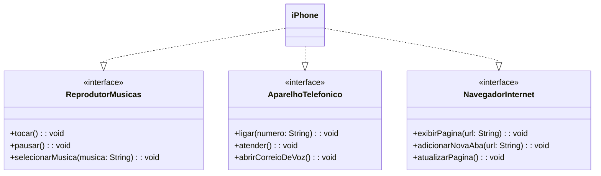

## Diagrama de Classes

```mermaid
classDiagram
    class iPhone {
    }

    %% Reprodutor de Musicas
    class ReprodutorMusicas {
        <<interface>>
        +tocar(): void
        +pausar(): void
        +selecionarMusica(musica: String): void
    }

    %% Aparelho Telefonico
    class AparelhoTelefonico {
        <<interface>>
        +ligar(numero: String): void
        +atender(): void
        +abrirCorreioDeVoz(): void
    }

    %% Navegador de Internet
    class NavegadorInternet {
        <<interface>>
        +exibirPagina(url: String): void
        +adicionarNovaAba(url: String): void
        +atualizarPagina(): void
    }

    iPhone ..|> ReprodutorMusicas
    iPhone ..|> AparelhoTelefonico
    iPhone ..|> NavegadorInternet

```